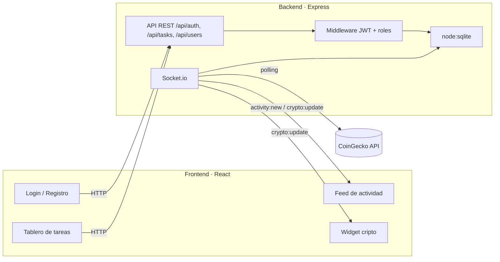

# TaskFlow

Gestor de tareas de equipo con autenticación por roles y un dashboard en tiempo real. Proyecto personal construido para practicar y demostrar un flujo full-stack completo: API REST, WebSockets, autorización basada en roles y consumo de una API pública externa.

> Proyecto de portfolio — código abierto bajo licencia MIT.

## Índice

- [Qué hace](#qué-hace)
- [Por qué estas decisiones técnicas](#por-qué-estas-decisiones-técnicas)
- [Stack](#stack)
- [Arquitectura](#arquitectura)
- [Puesta en marcha](#puesta-en-marcha)
- [Scripts disponibles](#scripts-disponibles)
- [Referencia de la API](#referencia-de-la-api)
- [Roles y permisos](#roles-y-permisos)
- [Tests y CI](#tests-y-ci)
- [Estructura del proyecto](#estructura-del-proyecto)
- [Roadmap](#roadmap)
- [Licencia](#licencia)

## Qué hace

TaskFlow es una app de equipo organizada en **secciones**, cada una demostrando una capacidad distinta del stack:

- **Tablero** — gestión de tareas con tres niveles de permiso (`admin`, `miembro`, `invitado`) que controlan quién puede crear, editar o eliminar. Registro/login con JWT; los cambios se sincronizan por WebSockets a todos los usuarios conectados.
- **Mercado** — precios de criptomonedas en vivo (retransmitidos por WebSocket) e histórico de 30 días de Bitcoin en un gráfico SVG propio. Fuente: [CoinGecko](https://www.coingecko.com/en/api/documentation) (gratuita, sin API key), con caché en el backend.
- **Clima** — condiciones actuales y pronóstico a 7 días de cualquier ciudad, con buscador con geocodificación. Fuente: [Open-Meteo](https://open-meteo.com/) (gratuita, sin API key), con caché por ciudad.

Las secciones de Mercado y Clima existen como prueba de consumo de servicios de terceros: cada una integra una API pública distinta, siempre proxied y cacheada por el backend (el navegador nunca llama a la API externa directamente).

## Por qué estas decisiones técnicas

- **JWT con rol embebido** en vez de sesiones en servidor: sin estado, fácil de escalar horizontalmente, y el mismo token autentica tanto la API REST como la conexión de Socket.io.
- **`node:sqlite` en vez de `better-sqlite3` u otro driver con bindings nativos**: cero dependencias que compilar, cero fallos de instalación en máquinas o pipelines de CI con restricciones de red. Alcanza con `pnpm install` y correr.
- **Polling en el backend + push por WebSocket** para los precios de cripto: CoinGecko no ofrece un stream nativo, así que el servidor centraliza el sondeo (evita que cada cliente golpee la API externa) y difunde el resultado a todos los clientes conectados.
- **Roles verificados en middleware de Express**, no solo ocultando botones en el frontend: cualquier intento de bypass desde la API se corta en el backend (ver tests en `backend/src/tests/roles.test.ts`).

## Stack

| Capa | Tecnología |
|---|---|
| Backend | Node.js, Express, TypeScript, Socket.io, `node:sqlite`, JWT, bcrypt, Zod |
| Frontend | React, Vite, TypeScript, React Router, Tailwind CSS, Axios, Socket.io-client |
| Tests | Jest + Supertest (backend) |
| CI | GitHub Actions (lint + typecheck + tests + build) |
| API externa | CoinGecko (pública, sin API key) |

## Arquitectura



Flujo resumido: el cliente autentica vía REST y recibe un JWT; ese mismo token se usa para abrir la conexión de Socket.io. El backend centraliza el acceso a la base de datos y al polling de CoinGecko, y difunde ambos tipos de eventos (actividad del equipo y precios) a todos los clientes conectados.

## Puesta en marcha

### Requisitos

- Node.js **>= 22.5** (usa el módulo nativo `node:sqlite`)
- pnpm 11+ (el proyecto usa pnpm como gestor de paquetes; npm está bloqueado vía `only-allow`)

### 1. Clonar e instalar

```bash
git clone <url-del-repo>
cd taskflow

cd backend && pnpm install
cd ../frontend && pnpm install
```

### 2. Variables de entorno

```bash
cp backend/.env.example backend/.env
cp frontend/.env.example frontend/.env
```

Los valores por defecto ya funcionan en local; ajustá `JWT_SECRET` si vas a desplegar el proyecto.

### 3. Correr en desarrollo

En dos terminales:

```bash
# Terminal 1
cd backend && pnpm dev

# Terminal 2
cd frontend && pnpm dev
```

Abrí `http://localhost:5173`. El primer usuario que se registre queda como **admin** automáticamente.

## Scripts disponibles

**Backend** (`/backend`)

| Script | Descripción |
|---|---|
| `pnpm dev` | Servidor con recarga automática |
| `pnpm build` | Compila TypeScript a `dist/` |
| `pnpm start` | Corre la versión compilada |
| `pnpm test` | Corre los tests con Jest |
| `pnpm lint` | ESLint sobre `src/` |

**Frontend** (`/frontend`)

| Script | Descripción |
|---|---|
| `pnpm dev` | Servidor de desarrollo de Vite |
| `pnpm build` | Build de producción |
| `pnpm preview` | Sirve el build de producción localmente |
| `pnpm lint` | ESLint sobre `src/` |

## Referencia de la API

Base URL: `http://localhost:4000/api`

| Método | Ruta | Auth | Rol requerido | Descripción |
|---|---|---|---|---|
| POST | `/auth/register` | No | — | Crea una cuenta. El primer usuario registrado recibe el rol `admin` |
| POST | `/auth/login` | No | — | Devuelve `{ token, user }` |
| GET | `/auth/me` | Sí | cualquiera | Usuario vigente según la base; el cliente refresca la sesión con esto |
| GET | `/tasks` | Sí | cualquiera | Lista todas las tareas |
| POST | `/tasks` | Sí | `admin`, `miembro` | Crea una tarea |
| PATCH | `/tasks/:id/status` | Sí | `admin`, `miembro` | Cambia el estado de una tarea |
| DELETE | `/tasks/:id` | Sí | `admin` | Elimina una tarea |
| GET | `/users` | Sí | cualquiera | Lista usuarios (sin datos sensibles) |
| PATCH | `/users/:id/role` | Sí | `admin` | Cambia el rol de otro usuario |
| GET | `/crypto/history` | Sí | cualquiera | Histórico 30 días de Bitcoin (fuente: CoinGecko, caché 30 min) |
| GET | `/weather?city=...` | Sí | cualquiera | Clima actual + pronóstico 7 días (fuente: Open-Meteo, caché 10 min) |

Autenticación: header `Authorization: Bearer <token>`.

### Eventos de WebSocket

El cliente se conecta pasando el JWT en `socket.handshake.auth.token`.

| Evento | Dirección | Payload |
|---|---|---|
| `activity:new` | servidor → cliente | Alguien creó/editó/eliminó una tarea; el tablero recarga en tiempo real |
| `crypto:update` | servidor → cliente | Precios actualizados de BTC/ETH/SOL |
| `crypto:error` | servidor → cliente | Error al consultar CoinGecko |

## Roles y permisos

| Acción | admin | miembro | invitado |
|---|:---:|:---:|:---:|
| Ver tareas | ✅ | ✅ | ✅ |
| Crear / actualizar estado | ✅ | ✅ | ❌ |
| Eliminar tareas | ✅ | ❌ | ❌ |
| Cambiar rol de otro usuario | ✅ | ❌ | ❌ |

El primer usuario registrado en una instancia nueva recibe `admin` automáticamente; desde ahí puede promover o degradar a otros usuarios vía `PATCH /users/:id/role`.

### Decisiones de seguridad

- **El rol vigente se lee de la base en cada acción privilegiada**, no del JWT: degradar a un admin surte efecto inmediato aunque su token siga sin expirar (limitación clásica de los JWT sin estado, resuelta acá con una lectura extra que en SQLite es gratis).
- **No se puede degradar al único admin** de la instancia: la API responde `409` para evitar dejarla sin administración.
- **Rate limiting en `/api/auth`** (20 intentos / 15 min por IP) contra fuerza bruta de credenciales, y cabeceras endurecidas con `helmet`.
- Las contraseñas se guardan con hash bcrypt; los payloads se validan con Zod antes de tocar la base.

## Tests y CI

```bash
cd backend && pnpm test
```

Cubre registro/login, hash de contraseñas, asignación del primer rol admin, y control de acceso por rol (crear/eliminar tareas según permisos). El workflow de GitHub Actions (`.github/workflows/ci.yml`) corre lint, typecheck, tests y build en cada push/PR.

## Estructura del proyecto

```
taskflow/
├── backend/
│   ├── src/
│   │   ├── config/        # Variables de entorno
│   │   ├── db/            # node:sqlite + esquema
│   │   ├── middleware/     # Auth (JWT) y roles
│   │   ├── models/         # User, Task, Activity
│   │   ├── routes/         # /auth, /tasks, /users
│   │   ├── services/       # authService, cryptoService (CoinGecko)
│   │   ├── tests/          # Jest + Supertest
│   │   ├── ws/             # Socket.io + estado compartido
│   │   ├── app.ts
│   │   └── index.ts
│   └── package.json
├── frontend/
│   ├── src/
│   │   ├── components/     # TaskBoard, ActivityFeed, CryptoWidget...
│   │   ├── hooks/           # useAuth, useRealtime
│   │   ├── pages/           # Login, Register, Dashboard
│   │   ├── services/        # api.ts (Axios), socket.ts
│   │   └── types/
│   └── package.json
├── .github/workflows/ci.yml
└── docs/
```

## Roadmap

Ideas para seguir extendiendo el proyecto (no implementadas todavía, útiles como conversación en una entrevista):

- Paginación e infinite scroll en el tablero de tareas
- Notificaciones push del navegador para nuevas asignaciones
- Migrar de JWT en `localStorage` a cookies `httpOnly` + refresh tokens
- Tests end-to-end con Playwright sobre el frontend
- Dockerfile + docker-compose para levantar todo con un comando

## Licencia

MIT — ver [LICENSE](./LICENSE).
